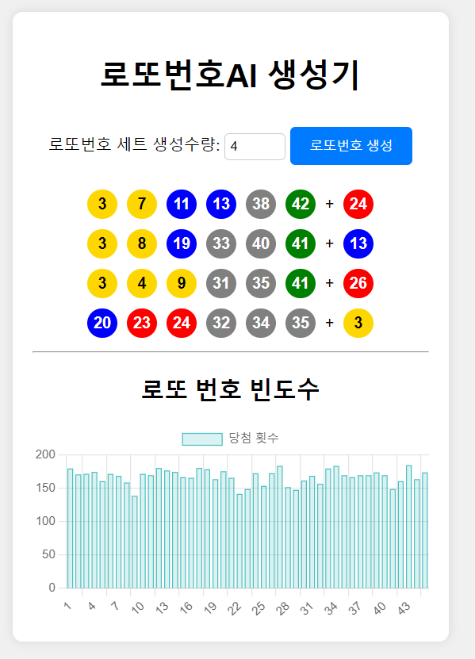

# 로또번호생성기 웹앱
스크린샷 


## 배포
1. Dockerfile 내용 참조
```
# Use the Nginx image from the Docker Hub
FROM nginx:alpine

# Install git
RUN apk --no-cache add git

# Remove the default Nginx configuration file
RUN rm -f /etc/nginx/conf.d/*

# Volume 설정을 사용하여 호스트 디렉토리와 연결합니다.
VOLUME ["/usr/share/nginx/html/", "/etc/nginx/conf.d/"]

# Since the user will mount volumes at runtime, 
# there's no need to COPY the files at build-time
```

2. docker-compose.yml 참조
```
version: '3'

services:
  nginx:
    build:
      context: .
      dockerfile: Dockerfile
    ports:
      - "9010:80"
    volumes:
      - ./html/:/usr/share/nginx/html/
      - ./nginx_conf/nginx.conf:/etc/nginx/conf.d/default.conf

```

2. docker로 실행허기
```sh
docker-compose up -d
```


